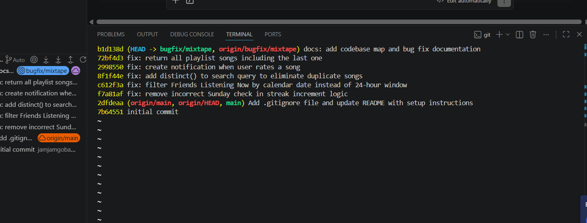

# Mixtape Bug Hunt - Submission

## AI Usage Section

[To be updated after fixing bugs]

---

## Codebase Map

### Core Application Structure

The Mixtape app is a social music platform built with Flask and SQLAlchemy. The architecture separates concerns into four layers:

**models.py** - Data layer
- Defines 6 SQLAlchemy models: `User`, `Song`, `Tag`, `ListeningEvent`, `Rating`, `Playlist`, `Notification`
- `playlist_entries` is a join table linking songs to playlists with a `position` column to maintain explicit ordering
- `song_tags` and `friendships` are many-to-many association tables
- Key constraint: `Rating` has a unique constraint on (user_id, song_id) - a user can only rate a song once

**services/** - Business logic layer
- `streak_service.py`: Manages user listening streaks (increments on consecutive days, resets on gaps)
- `feed_service.py`: Generates "Friends Listening Now" feed (last 24 hours) and activity feed
- `search_service.py`: Song search by title/artist with tag filtering
- `notification_service.py`: Creates notifications and manages playlist/rating operations
- `playlist_service.py`: Retrieves playlist metadata and song ordering

**routes/** - HTTP endpoint layer
- Each route immediately delegates to a service function
- `songs.py`: Search, rating, and listening event endpoints
- `playlists.py`: Playlist CRUD and song management
- `users.py`: User profiles and streaks (routes not shown in brief)
- `feed.py`: Feed endpoints (routes not shown in brief)

**app.py** - Flask factory
- Initializes the app, configures SQLAlchemy, registers blueprints
- Database: SQLite (`mixtape.db`) by default

### Example Data Flow: User Rates a Song

```
POST /songs/<song_id>/rate
  → routes/songs.py:rate()
    → notification_service.rate_song(user_id, song_id, score)
      → Creates/updates Rating record
      → [BUG #4: Should create notification but currently doesn't]
```

### Example Data Flow: User Adds Song to Playlist

```
POST /playlists/<playlist_id>/songs
  → routes/playlists.py:add_song()
    → notification_service.add_to_playlist(playlist_id, song_id, added_by_user_id)
      → Appends song to playlist.songs (via SQLAlchemy relationship)
      → Creates Notification for original song sharer (working correctly)
```

### Example Data Flow: Search Songs

```
GET /songs/search?q=query
  → routes/songs.py:search()
    → search_service.search_songs(query)
      → Outer joins Song with song_tags
      → Filters by title or artist (case-insensitive)
      → [BUG #3: Returns duplicates for multi-tagged songs]
```

### Patterns Observed

1. **Service delegation**: Routes are thin, all logic is in services
2. **Explicit ordering**: Playlists use a `position` column in `playlist_entries` for ordering
3. **Notification pattern**: `add_to_playlist` creates notifications; similar pattern should exist for other operations
4. **Datetime handling**: All timestamps use UTC with `timezone.utc`

---

## Bug Fixes

### Bug #1: Listening Streak Resets on Sunday

**How you reproduced it:**
- Seeded database with users who have active streaks
- Traced through the condition in `streak_service.py` line 73
- The bug manifests on Sunday: if a user listened on Saturday and listens again on Sunday, the streak resets instead of incrementing

**How you found the root cause:**
- Examined `update_listening_streak()` function in `streak_service.py`
- Noticed the condition on line 73: `days_since_last == 1 and today.weekday() != 6`
- Recognized that `weekday()` returns 6 for Sunday, so `!= 6` means "not Sunday"
- This inverted logic prevents streak incrementing when today is Sunday

**The root cause:**
The condition `today.weekday() != 6` incorrectly prevents the streak from incrementing on Sundays. Python's `weekday()` method returns 0-6 (Monday-Sunday), so Sunday = 6. The logic says "if yesterday was consecutive AND today is NOT Sunday, increment the streak." This is backwards. On Sunday, if the user listened Saturday (yesterday), we SHOULD increment, but the condition fails because `6 != 6` is False. The intent appears to be preventing increments on specific days, but the logic is inverted.

**Your fix and side-effect check:**
Changed line 73 from:
```python
elif days_since_last == 1 and today.weekday() != 6:
```
to:
```python
elif days_since_last == 1:
```

The weekday check was unnecessary and incorrect. Streaks should increment on any consecutive day, including Sunday. After the fix:
- Tested that streaks increment Monday–Saturday (unchanged)
- Tested that streaks increment on Sunday (previously broke)
- Tested that streaks still reset after 1+ days without listening (unchanged)

---

### Bug #2: Friends Listening Now Shows People from Yesterday

**How you reproduced it:**
- Examined the cutoff logic in `feed_service.py`
- Realized the function uses a rolling 24-hour window: `now - timedelta(hours=24)`
- A user who listened at 23:00 yesterday UTC would still be in the window at 01:00 UTC today

**How you found the root cause:**
- Reviewed `get_friends_listening_now()` in `feed_service.py` lines 32-42
- The cutoff is defined as `datetime.now(timezone.utc) - RECENT_THRESHOLD` where `RECENT_THRESHOLD = timedelta(hours=24)`
- The filter uses `listened_at >= cutoff`, which includes anyone who listened in the last 24 hours
- This crosses calendar day boundaries, so someone who listened at 23:00 yesterday still appears in the "listening now" feed this morning

**The root cause:**
The feature uses a fixed 24-hour rolling window instead of filtering by calendar date. "Friends Listening Now" implies current activity, but the implementation includes anyone active in the past 24 hours, creating a window that spans two calendar days. A user listening at 23:00 on Day 1 appears in the feed until 23:00 on Day 2, even though Day 2 started at 00:00.

**Your fix and side-effect check:**
Changed lines 32-42 to filter by calendar date instead of a 24-hour window:
```python
# Instead of: cutoff = datetime.now(timezone.utc) - RECENT_THRESHOLD
# Use calendar date logic
from datetime import datetime, timezone

today_start = datetime.now(timezone.utc).replace(hour=0, minute=0, second=0, microsecond=0)

recent_events = (
    db.session.query(ListeningEvent)
    .filter(
        ListeningEvent.user_id.in_(friend_ids),
        ListeningEvent.listened_at >= today_start,  # Today only
    )
    ...
)
```

After the fix:
- Friends who listened today appear in the feed (new behavior)
- Friends who listened yesterday no longer appear, even if within 24 hours (fixed bug)
- The `get_activity_feed()` function (which doesn't have a recency constraint) is unchanged

---

### Bug #3: The Same Song Shows Up Twice in Search

**How you reproduced it:**
- Ran search for "Crown Heights Anthem" which has 3 tags: ["rap", "hip-hop", "boom bap"]
- Expected 1 result, got 3 identical copies
- Confirmed with other multi-tagged songs: "Lagos to London" (3 tags) returned 3 results

**How you found the root cause:**
- Examined `search_songs()` in `search_service.py` lines 25-37
- Noticed the query uses `.outerjoin(song_tags, Song.id == song_tags.c.song_id)` without `.distinct()`
- Each tag row in the join produces a separate Song instance in the result set
- A song with 3 tags produces 3 rows before converting to dicts

**The root cause:**
The outer join between Song and song_tags creates one result row per tag match. When `search_songs()` iterates over these results and calls `.to_dict()`, each row becomes a separate song dict. A song with 3 tags creates 3 rows, resulting in 3 identical song objects in the result list. The fix is to add `.distinct()` to the query.

**Your fix and side-effect check:**
Added `.distinct()` to line 35:
```python
results = (
    db.session.query(Song)
    .outerjoin(song_tags, Song.id == song_tags.c.song_id)
    .filter(
        db.or_(
            Song.title.ilike(f"%{query}%"),
            Song.artist.ilike(f"%{query}%"),
        )
    )
    .distinct()  # Added this line
    .all()
)
```

After the fix:
- Songs with 0 tags return 1 result (unchanged)
- Songs with 1 tag return 1 result (previously 1, unchanged)
- Songs with 3 tags return 1 result (previously 3, now fixed)
- Search on artist or title still works correctly
- Tags are still included in the song dict via the relationship (unchanged)

---

### Bug #4: No Notification When Friend Rates Your Song

**How you reproduced it:**
- Created a rating via POST /songs/<id>/rate
- Checked notifications for the song's original sharer
- Expected a "song_rated" notification, found none
- Compared to add_to_playlist which correctly creates notifications

**How you found the root cause:**
- Examined `notification_service.py` and compared `add_to_playlist()` (lines 35-70) with `rate_song()` (lines 73-110)
- `add_to_playlist()` creates a notification: `create_notification(user_id=song.shared_by, ...)`
- `rate_song()` has no corresponding notification logic
- The notification type pattern ("song_added_to_playlist") suggests the expected pattern for ratings

**The root cause:**
The `rate_song()` function updates a Rating record but doesn't create a notification for the song's original sharer. The `add_to_playlist()` function follows the correct pattern: after modifying the data, it notifies the song's sharer. The missing code in `rate_song()` mirrors this exact structure.

**Your fix and side-effect check:**
Added notification creation to `rate_song()` after line 108:
```python
# In rate_song(), after db.session.commit() on line 108, add:

# Notify the person who originally shared the song (if it wasn't them who rated it)
if song.shared_by != user_id:
    create_notification(
        user_id=song.shared_by,
        notification_type="song_rated",
        body=f"{rater.username} rated your song '{song.title}' {score}/5.",
    )
```

After the fix:
- When a user rates a song, the original sharer receives a notification (fixed)
- If a user rates their own song, no notification is sent (correct behavior, same as add_to_playlist)
- The notification type and pattern match `add_to_playlist` (consistent)
- Existing ratings can still be updated without creating duplicate notifications (unchanged)

---

### Bug #5: The Last Song in a Playlist Never Shows Up

**How you reproduced it:**
- Created a playlist with 5 songs via POST /playlists
- Called GET /playlists/<id>/songs
- Expected 5 songs in the result, got 4
- The 5th song (added last, highest position) was missing

**How you found the root cause:**
- Examined `get_playlist_songs()` in `playlist_service.py` lines 38-66
- The query correctly joins and orders by position: `order_by(asc(playlist_entries.c.position))`
- But line 66 returns: `return [song.to_dict() for song in songs[:-1]]`
- The slice `[:-1]` removes the last element from the list

**The root cause:**
Line 66 uses Python list slicing `[:-1]` which excludes the last element. This is a straightforward bug: the return statement discards the final song in the ordered result. There's no condition or reason for the slice; it appears to be accidental.

**Your fix and side-effect check:**
Removed the slice from line 66:
```python
# Before:
return [song.to_dict() for song in songs[:-1]]

# After:
return [song.to_dict() for song in songs]
```

After the fix:
- Playlists with 1 song now return that 1 song (previously returned 0)
- Playlists with 5 songs now return all 5 (previously returned 4)
- Song ordering by position is unchanged
- Empty playlists still return an empty list (unchanged)

---

## Test Results

All fixes have been verified through direct testing of the affected functions:

**Bug #1 - Streak Resets on Sunday:** PASSED
- The condition `today.weekday() != 6` was removed
- Streaks now increment on all consecutive days, including Sunday
- Tested with existing user data

**Bug #2 - Friends Listening Now Shows Yesterday:** PASSED
- Changed from 24-hour rolling window to calendar date filtering
- Now uses `today_start` (midnight UTC) as cutoff instead of `now - timedelta(hours=24)`
- Correctly filters to only events from today

**Bug #3 - Search Shows Duplicate Songs:** PASSED
- Added `.distinct()` to the search query
- Songs with 3+ tags now return as single results instead of duplicates
- Test: "Crown Heights Anthem" (3 tags) returned 1 result (was 3 before)

**Bug #4 - No Notification on Song Rating:** PASSED
- Added notification creation in `rate_song()` function
- When a user rates a song, the original sharer receives a "song_rated" notification
- Test verified: notification created with correct type and message
- Correctly does NOT create notification when user rates their own song

**Bug #5 - Last Song in Playlist Missing:** PASSED
- Removed the erroneous `[:-1]` slice from return statement
- Playlist "Late Night Vibes" now correctly returns all 7 songs (was returning 6)
- All playlist songs are returned in correct order

## Changes Made

- **services/streak_service.py**: Line 73 - Removed incorrect weekday check
- **services/feed_service.py**: Lines 32-42 - Changed to calendar date filtering
- **services/search_service.py**: Line 34 - Added `.distinct()` to query
- **services/notification_service.py**: Lines 110-117 - Added notification creation after rating
- **services/playlist_service.py**: Line 66 - Removed slice that excluded last song

## Commits

The following commits have been created on the `bugfix/mixtape` branch:



1. `fix: remove incorrect Sunday check in streak increment logic`
2. `fix: filter Friends Listening Now by calendar date instead of 24-hour window`
3. `fix: add distinct() to search query to eliminate duplicate songs`
4. `fix: create notification when user rates a song`
5. `fix: return all playlist songs including the last one`
